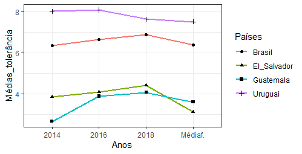
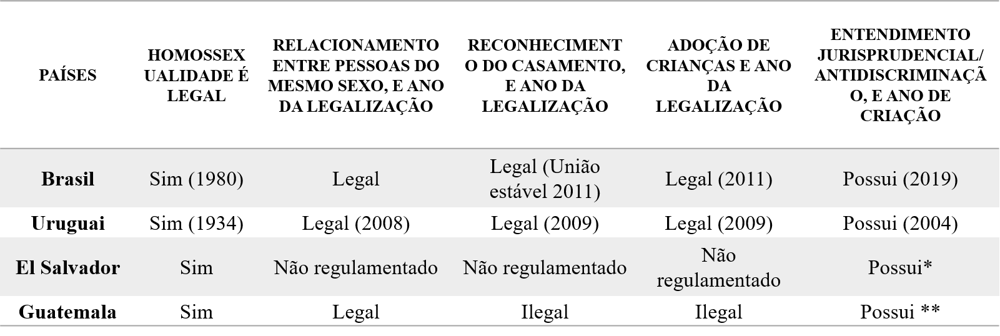
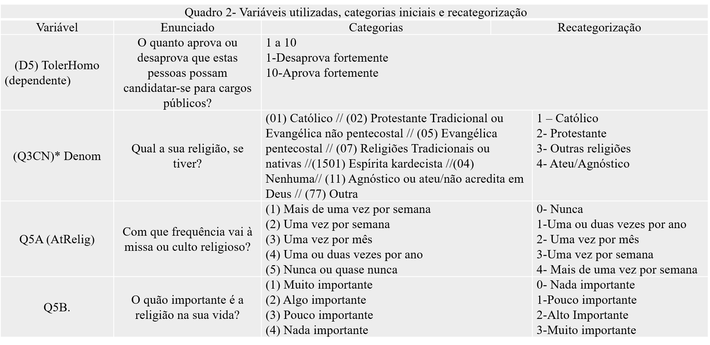

```{r setup, include = FALSE, out.width = '50%', warning= FALSE, echo=FALSE} 
knitr::opts_chunk$set(fig.align = 'center', echo = FALSE)

```

<style> 

h1.title { 
 color: black
 background-color: #f5f5f5;
 font-family: Times New Roman; 
 font-size: 35px;
}

body { 
 color: black;
 font-family: Times New Roman;
 backgroud-color: black;
 font-size: 20px;  
} 
pre { 
 color: #708090;
 backgroud-color: #f5f5f5;
} 
</style>


```{r echo = FALSE, warning = FALSE, include = FALSE}
library(dplyr)
library(plotly)
library(knitr)
library(rmarkdown)
tinytex::install_tinytex()
options(scipen = 999)


```


# Introdução {.tabset .tabset-fade}

## Objetivo: 
1. Constatar a relação entre religião e tolerância política em países da América Latina e identificar quais aspectos religiosos são mais proeminentes no ato de tolerar

"Utilizamos medidas que analisam três aspectos religiosos, em conformidade com a tríade: 1) comportamentos, 2) pertencimento, 3) e crenças (no inglês, The Three Bs: behavior, belonging e beliefs) (LEEGE; KELLSTEDT; WALD, 1996)."
\vspace{5truemm} 

## Material Empírico: 
Surveys fornecidos pelo Latin American Public Opinion Project (LAPOP)
Período analisado: 2014, 2016/2017 e 2018/2019


## Países: 
**Brasil, Uruguai, El Salvador e Guatemala** (i)
```{r, echo=FALSE, out.width="80%", fig.align='center'}

```

## Hipótese: 
H1 - Países com os menores índices de tolerância possuem indivíduos ativos religiosamente, que atribuem maior importância a religião e são filiados a denominações religiosas mais conservadoras. Acredita-se que as três variáveis citadas sejam fortes preditoras da diminuição da tolerância política em dois dos países analisados, pois possuem as menores médias simples de tolerância.


"Quadro 1 - Síntese dos direitos dos homossexuais nos países que comporão a tese (ii)"
```{r, echo=FALSE, out.width="100%", fig.align='center'}

```


*Algumas leis contrárias à discriminação
** Antidiscriminação na Lei da Infância e da Juventude desde 1997
Fonte: Autora, 2021, a partir da legislação dos países. 


\vspace{5truemm} 

# Dados, objetivos e Metodologia {.tabset .tabset-fade}

## Metodologia: Quantitativa

## Dados:
```{r, echo=FALSE, out.width="100%", fig.align='center'}

```

```{r, echo=FALSE}
#Naiara lembrar que não é possível inserir imagens de determinados sites, as imagens devem estar baixadas no computador ou então o r tem q ser capaz de puxar essas imagens
```


*Obs.: As categorias originais dessa variável mudam a depender do ano de aplicação ou do país, mas todos possuem as denominações: católica, protestante, outras denominações e ateu/agnóstico, por isso foi possível realizar a mesma recategorização idêntica para todos os casos. 
Fonte: Autora, a partir do dicionário de códigos do LAPOP Brazil, 2019


```{r include = FALSE}
library(haven)
library(memisc)
library(desc)
library(descr)
library(ggplot2)
library(RColorBrewer)
library(gridExtra)

```


\vspace{5truemm} 
## Descritivas:

Gráfico 1 – Projeções gráficas do total de observações por ano em cada país analisado e da frequência de cada denominação religiosa

```{r  }
Anos <- c(rep(c("2014", "2017", "2019"), each= 4))
Religiões <- c(rep(c("Católicos", "Evangélicos", "Outras",  "Ateus")))
Frequência <-c(846, 453,  34, 132, 776, 487,  42, 134, 746, 463,  25, 178)
Data <- data.frame(Anos, Religiões, Frequência)

GráficoB <- ggplot(Data, aes(x = Anos, y = Frequência,
                 fill = Religiões, label = Frequência)) +
  geom_bar(stat = "identity") +
  geom_text(size = 3, position = position_stack(vjust = 0.5))

União1<- GráficoB + theme_bw() + labs(title = "Brasil")+
  scale_fill_brewer(palette = "Set3", type = "seq")

#

Anos <- c(rep(c("2014", "2016", "2018"), each= 4))
Religiões <- c(rep(c("Católicos", "Evangélicos", "Outras",  "Ateus")))
Frequência <-c(678, 605,  37, 190, 755, 502, 142, 121 , 679, 601, 3, 201)
Data <- data.frame(Anos, Religiões, Frequência)

GráficoEl <- ggplot(Data, aes(x = Anos, y = Frequência,
                             fill = Religiões, label = Frequência)) +
  geom_bar(stat = "identity") +
  geom_text(size = 3, position = position_stack(vjust = 0.5))

União2 <- GráficoEl + theme_bw() + labs(title = "El Salvador")+
  scale_fill_brewer(palette = "Set3", type = "seq")

#

Anos <- c(rep(c("2014", "2016", "2018"),  each= 4))  
Religiões <- c(rep(c("Católicos", "Evangélicos", "Outras",  "Ateus")))
Frequência <-c(729, 612, 39, 108, 773, 641,  27,  37, 772, 633, 3, 92)
Data <- data.frame(Anos, Religiões, Frequência)

GráficoGua <- ggplot(Data, aes(x = Anos, y = Frequência,
                              fill = Religiões, label = Frequência)) +
  geom_bar(stat = "identity") +
  geom_text(size = 3, position = position_stack(vjust = 0.5))

União3 <- GráficoGua + theme_bw() + labs(title = "Guatemala")+
  scale_fill_brewer(palette = "Set3", type = "seq")


#

Anos <- c(rep(c("2014", "2016", "2018"),  each= 4))  
Religiões <- c(rep(c("Católicos", "Evangélicos", "Outras",  "Ateus")))
Frequência <-c(534, 173, 272, 422, 640, 159, 325, 309, 477, 176, 349, 550)
DataUru <- data.frame(Anos, Religiões, Frequência)

GráficoUru <- ggplot(DataUru, aes(x = Anos, y = Frequência,
                               fill = Religiões, label = Frequência)) +
  geom_bar(stat = "identity") +
  geom_text(size = 3, position = position_stack(vjust = 0.5))

União4 <- GráficoUru + theme_bw() + labs(title = "Uruguai") +
  scale_fill_brewer(palette = "Set3", type = "seq")


grid.arrange(União1, União2, União3, União4, ncol=2, nrow = 2)


```


\vspace{5truemm} 

# Resultados
Tabela 1- Influência da religião sobre a tolerância política em relação aos homossexuais em quatro países da América Latina 2014
```{r, echo=FALSE, out.width="80%", fig.align='center'}

```
Fonte: Autora, a partir LAPOP

Tabela 2- Influência da religião sobre a tolerância política em relação aos homossexuais em quatro países da América Latina 2016/2017
```{r, echo=FALSE, out.width="80%", fig.align='center'}
knitr::include_graphics("tabela2.png")
```
Fonte: Autora, a partir LAPOP

Tabela 3- Influência da religião sobre a tolerância política em relação aos homossexuais em quatro países da América Latina 2018/2019
```{r, echo=FALSE, out.width="80%", fig.align='center'}

```
Fonte: Autora, a partir LAPOP


\vspace{5truemm} 

# Considerações finais
Apesar da hipótese inicial ter sido apenas parcialmente confirmada, acredita-se que a principal contribuição do artigo é demonstrar que em pelo menos um aspecto religioso, a filiação denominacional (belonging), há evidências de forte influência na diminuição da tolerância política aos homossexuais. Muito embora, não seja possível afirmar que a religião seja a causa da intolerância, já que os testes não apresentam resultados referentes a causalidade, pode-se inferir que existem relações e correlações, e conforme aumenta a frequência religiosa, bem como, a filiação a denominação protestente, aumenta também a tendencia de atitudes de intolerância aos gays e lésbicas.

